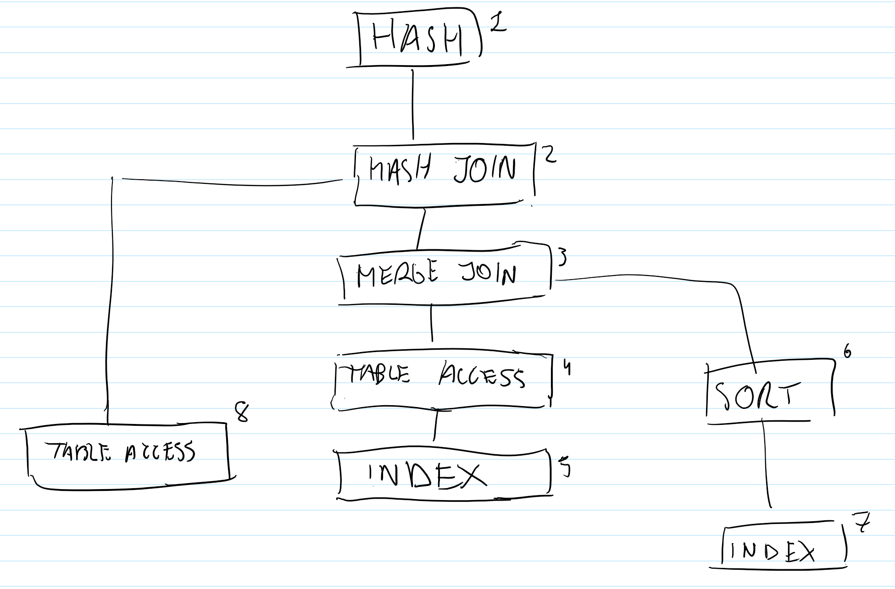

# ABD Practica 4 semana 1

## Apartado 2

### Apartado a

- Consulta 1:

| OPERATION | OPTIONS | OBJECT_NAME | COST | CARDINALITY | PARENT_ID | ID |
|--------------|----------------|--------------|------|-------------|-----------|----|
| SORT | UNIQUE | - | 7 | 6 | 0 | 1 |
| UNION-ALL | - | - | - | - | 1 | 2 |
| TABLE ACCESS | BY INDEX ROWID | CLIENTE | 2 | 5 | 2 | 3 |
| INDEX | RANGE SCAN | SYS_C0018955 | 1 | 5 | 3 | 4 |
| TABLE ACCESS | FULL | MOROSO | 3 | 1 | 2 | 5 |

- Consulta 2:

| OPERATION | OPTIONS | OBJECT_NAME | COST | CARDINALITY | PARENT_ID | ID |
|--------------|----------------|--------------|------|-------------|-----------|----|
| SORT | UNIQUE | - | 6 | 2 | 0 | 1 |
| UNION-ALL | - | - | - | - | 1 | 2 |
| TABLE ACCESS | BY INDEX ROWID | CLIENTE | 1 | 1 | 2 | 3 |
| INDEX | UNIQUE SCAN | SYS_C0018955 | 0 | 1 | 3 | 4 |
| TABLE ACCESS | FULL | MOROSO | 3 | 1 | 2 | 5 |

- Consulta 3:

| OPERATION | OPTIONS | OBJECT_NAME | COST | CARDINALITY | PARENT_ID | ID |
|--------------|----------------|--------------|------|-------------|-----------|----|
| NESTED LOOPS | - | - | - | - | 0 | 1 |
| NESTED LOOPS | - | - | 4 | 1 | 1 | 2 |
| TABLE ACCESS | FULL | MOROSO | 3 | 1 | 2 | 3 |
| INDEX | UNIQUE SCAN | SYS_C0018955 | 0 | 1 | 2 | 4 |
| TABLE ACCESS | BY INDEX ROWID | CLIENTE | 1 | 1 | 1 | 5 |

- Consulta 4:

| OPERATION | OPTIONS | OBJECT_NAME | COST | CARDINALITY | PARENT_ID | ID |
|--------------|----------------|--------------------|------|-------------|-----------|----|
| MERGE JOIN | SEMI | - | 4 | 1 | 0 | 1 |
| TABLE ACCESS | BY INDEX ROWID | CLIENTE | 2 | 6 | 1 | 2 |
| INDEX | FULL SCAN | SYS_C0018955 | 1 | 6 | 2 | 3 |
| SORT | UNIQUE | - | 2 | 26 | 1 | 4 |
| INDEX | FULL SCAN | CLAVE_INVIRTE_PRIM | 1 | 26 | 4 | 5 |

- Consulta 5:

| OPERATION | OPTIONS | OBJECT_NAME | COST | CARDINALITY | PARENT_ID | ID |
|--------------|----------------|--------------|------|-------------|-----------|----|
| NESTED LOOPS | - | - | - | - | 0 | 1 |
| NESTED LOOPS | - | - | 5 | 1 | 1 | 2 |
| SORT | UNIQUE | - | 3 | 1 | 2 | 3 |
| TABLE ACCESS | FULL | INVIERTE | 3 | 1 | 3 | 4 |
| INDEX | UNIQUE SCAN | SYS_C0018955 | 0 | 1 | 2 | 5 |
| TABLE ACCESS | BY INDEX ROWID | CLIENTE | 1 | 1 | 1 | 6 |

- Consulta 6: 

| OPERATION | OPTIONS | OBJECT_NAME | COST | CARDINALITY | PARENT_ID | ID |
|--------------|----------------|--------------------|------|-------------|-----------|----|
| HASH | UNIQUE | - | 9 | 4 | 0 | 1 |
| HASH JOIN | - | - | 8 | 49 | 1 | 2 |
| MERGE JOIN  | - | - | 4 | 7 | 2 | 3 |
| TABLE ACCESS | BY INDEX ROWID | CLIENTE | 2 | 6 | 3 | 4 |
| INDEX | FULL SCAN | SYS_C0018955 | 1 | 6 | 4 | 5 |
| SORT | JOIN | - | 2 | 7 | 3 | 6 |
| INDEX | FULL SCAN | CLAVE_INVIRTE_PRIM | 1 | 7 | 6 | 7 |
| TABLE ACCESS | FULL | COMPRAS | 3 | 23 | 2 | 8 |

### Apartado b

#### Apartado 1

La indexación en la tabla CLIENTE se realiza por rango en la consulta 1 porque el comparador de filtrado es `<`, por lo tanto, devolverá más de una tupla (id operación 4). En cambio, en la consulta 2 el comparador de filtrado es `=`, devolverá una única tupla.

#### Apartado 2

No accede por índice a MOROSO porque la condición de filtrado no utiliza la clave primaria, por lo tanto, el acceso es por tabla completa (table access full)

#### Apartado 3

Accede por índice a CLIENTE porque la condición de filtrado utiliza la clave primaria (única).

#### Apartado 4

¿Sí accede por índice?

### Apartado c

### Apartado d 

La explicación del plan que genera SQLDeveloper hace explícitos los predicados de acceso en las operaciones _sort_ y las operaciones _index_, pero el resto es igual.

### Apartado e

La explicación del plan es equivalente utilizando _F6_ o _F10_.

## Apartado 3

### Apartado a

| CONSULTA | COSTE(TOTAL) | CARDINALIDAD(TOTAL) | NUM.OPERACIONES | OBSERVACIONES |
|----------------------------------------------------------------------------------------------------------------------------------------------------------|--------------|---------------------|-----------------|---------------------------------------------------------------------------------------------------------------------------------------------------------------------------------------------------------|
| `select PELISAHORA.ID from PELISAHORA, PELISHIST where PELISAHORA.ID = PELISHIST.ID;` | 1 | 140 | 3 | Indexa en ambas tablas ya que utiliza la clave primaria de ambas tablas, por ello el coste es muy bajo. |
| `select PELISAHORA.DESCRIPCION from PELISAHORA, PELISHIST where PELISAHORA.DESCRIPCION = PELISHIST.DESCRIPCION;` | 88 | 140 | 3 | Accede a todas las tuplas de ambas tablas, ya que descripcion no es un index, lo cual es muy costoso. |
| `select PELISAHORA.TITULO from PELISAHORA, PELISHIST where PELISAHORA.TITULO = PELISHIST.TITULO;` | 4 | 140 | 3 | Utiliza el índice creado sobre la columna título por lo cual es rápido pero no tanto como indexar con clave primaria, ya que realiza un _range scan_ en vez de _unique scan_, lo cual aumenta el coste. |
| `select PELISAHORA.TITULO from PELISAHORA where PELISAHORA.TITULO in (select PELISHIST.TITULO from PELISHIST);` | 5 | 140 | 4 | Situación similar a la anterior pero utilizando una consulta anidada lo cual acarrea una operación más, un _sort_, lo cual aumenta el coste. |
| `select PELISAHORA.TITULO from PELISAHORA where PELISAHORA.TITULO in (select PELISHIST.TITULO from PELISHIST where PELISAHORA.TITULO = PELISHIST.TITULO);` | 5 | 140 | 4 | Situación similar a la anterior pero agrega una condición en la consulta anidada, que no aumenta el coste. |

### Apartado b

La consulta más eficiente es la primera ya que indexa por clave primaria lo cual acarrea una operación de indexación _unique scan_, que es más eficiente que las realizadas en el resto de consultas.

## Semana 10

### Seccion 1

- Coinciden E-Row y A-Row, por lo cual, la estimación es acertada.
- Los índices utilizados en la segunda consulta almacenan menos tuplas que los índices utilizados en la primera consulta. Por ello, trata con menos bufferes.
- Mirando las operaciones la más eficiente es la segunda. Mirando las A rows la segunda es más eficiente. Observando los bufferes la segunda es más eficiente. La segunda, en general, parece más eficiente.

### Seccion 2

#### Apartado 1

- Index_name, index_type, table_name, tablespace_name, leaf_blocks, blevel, distinct_keys, num_rows, global_stats.
- Solo son únicos los índices de clave primaria, ya que solo enlazan con una única posible tupla.
- Hay pocas tuplas para cada valor posible del índice. Hay pocos valores distintos para la columna _genero_.
- Son los valores diferentes almacenados para la columna correspondiente al índice. _Clustering _ factor_ evalúa el orden de la tabla índice con respecto al orden de la tabla original; cuenta el número de bloques que se leerán al escanear el índice.
- Su relación depende de la proporción de tuplas por número de valores distintos de la columna del índice correspondiente.

#### Apartado 2

- Table_name, tablespace_name, num_rows, cluster_name, empty_blocks, avg_space, avg_space_freelist_blocks, table_lock.
- Los blocks son la unidad de almacenamiento utilizada por Oracle para almacenar todos los datos sobre una base de datos. Cuantas más num_rows, más blocks habrá, ya que un block puede contener una cantidad fija de rows. Avg_row_len es más grande para pelisahora porque sus datos son más pesados.

### Seccion 3

Las estadísticas de la tabla proporcionan: número de filas, número de bloques, tamaño de fila medio, tamaño de muestra y la última vez que fue analizada la tabla.
Podemos conocer los siguientes parámetros estadísticos para cada una de las columnas de la tabla: número de valores distintos, _low value_, _high value_.

### Sección 4

- Muestra estadísticas del índice de clave primaria de la tabla PELISHIST y de esta misma tabla para nuestro usuario. Estas estadísticas han sido almacenadas anteriormente al ejecutar `dbms_stats.gather_index_stats` y `dbms_stats.gather_table_stats`.